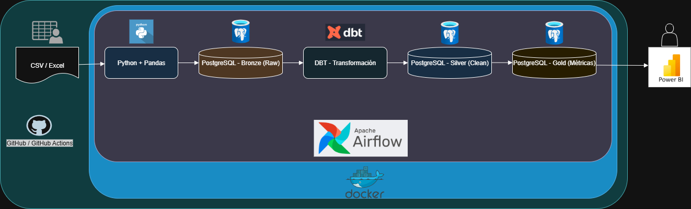

# Primer avance: DISEÑO DE LA ARQUITECTURA

## Descripción general del pipeline ELT: Documento Técnico

###  Objetivo del Pipeline

El objetivo principal del pipeline ELT es construir una solución robusta y escalable para integrar, transformar y analizar datos de alojamientos en la ciudad de Nueva York, basados en el dataset "data/AB_NYC.csv". Este pipeline permitirá cargar los datos de forma automatizada en un Data Warehouse y preparar la información en distintas capas para responder preguntas clave del negocio, como:

- ¿Cuáles son los barrios con mayor oferta de alojamientos?

- ¿Qué tipo de alojamiento tiene mayor disponibilidad y precio promedio?

- ¿Cómo varía la oferta según la ubicación geográfica?

La solución está diseñada para servir como base para análisis exploratorios, dashboards interactivos y futuros modelos de predicción sobre comportamiento del mercado de alquileres.

###  Etapas del pipeline ELT
El pipeline sigue la estrategia ELT (Extract, Load, Transform), que permite manejar grandes volúmenes de datos de manera eficiente, delegando las transformaciones al motor del Data Warehouse.

#### 1. Extract (Extracción)

-Fuente: archivo "data/AB_NYC.csv", que contiene información de alojamientos en NYC publicada en la plataforma Airbnb.

-Método: script Python que lee el CSV con Pandas, validando tipos de datos y controlando errores de lectura.

-Campos relevantes:  ``id``, ``name``, ``host_id``, ``neighbourhood_group``, ``neighbourhood``, ``latitude``, ``longitude``, ``room_type``, ``price``, ``minimum_nights``, ``number_of_reviews``, ``last_review``, ``reviews_per_month``, ``calculated_host_listings_count``, ``availability_365``.

#### 2. Load (Carga)
-Destino: tabla raw_listings en una base de datos PostgreSQL (capa raw del Data Warehouse).

-Método: carga directa del archivo sin transformaciones previas, para asegurar trazabilidad y auditoría.

-Mecanismo: se utiliza SQLAlchemy o psycopg2 para insertar los registros de forma eficiente.


#### 3. Transform (Transformación)
Herramienta: SQL (dbt) o scripts SQL programados desde Airflow.

Acciones:

-Limpieza de registros nulos o inválidos.

-Conversión de tipos de datos (por ejemplo, fechas y enteros).

-Creación de campos derivados: precio_categoria, zona_popular, etc.

-Modelado dimensional (tabla de hechos de alojamientos + dimensiones de barrios, tipo de habitación, etc.).

-Agregación para dashboards y reporting: promedio de precios por barrio, disponibilidad media, etc.

-Resultado: tablas en la capa core y gold, listas para análisis por parte del equipo de negocio.

## Diagrama de arquitectura

## Definición de capas del Data Warehouse
### 1. Bronze : Raw / Staging Layer

- **Propósito**:  
  Esta capa almacena los datos exactamente como fueron extraídos desde las fuentes originales, sin aplicar transformaciones ni validaciones. Sirve como respaldo para auditoría y como punto de partida para reprocesar información en caso de errores en etapas posteriores.

- **Características**:  
  - Formatos originales de columnas y valores.  
  - Pueden existir duplicados, valores nulos o inconsistentes.  
  - Datos persistidos de forma rápida, sin lógica de negocio.

- **Rol en el pipeline**:  
  Aísla la etapa de extracción del resto del proceso, permitiendo controlar versiones de datos y mantener trazabilidad histórica.


### 2. Silver : Capa Intermedia / Transformada 

- **Propósito**:  
  Transformar, limpiar y estructurar los datos provenientes de la capa raw. En esta etapa se aplican reglas de validación, tipificación, estandarización y enriquecimiento de datos.

- **Características**:  
  - Conversión de tipos de datos.  
  - Eliminación de registros inválidos.  
  - Normalización y creación de tablas dimensionadas (modelo relacional o dimensional).  
  - Generación de claves foráneas y relaciones entre tablas.

- **Rol en el pipeline**:  
  Prepara los datos para análisis aplicando reglas de negocio básicas. Esta capa es la base del modelo lógico del Data Warehouse.


### 3. Gold : Capa de Consumo / Modelo de Negocio 
- **Propósito**:  
  Contiene datasets listos para el análisis, visualización y generación de reportes. Representa los datos ya procesados y organizados según las necesidades del negocio.

- **Características**:  
  - Tablas agregadas por dimensiones clave.  
  - Métricas de negocio calculadas.
  - Campos derivados útiles para análisis predictivo o exploratorio.

- **Rol en el pipeline**:  
  Facilita el trabajo de analisis de datos, proporcionando información relevante y fácilmente accesible a través de dashboards y notebooks.

##  Justificación de Herramientas y Tecnologías

Este pipeline ELT fue construido utilizando un conjunto de herramientas seleccionadas cuidadosamente en función de su **escalabilidad**, **facilidad de integración**, **rendimiento** y **adecuación al contexto** del proyecto.

| Herramienta | Rol en el Pipeline | Justificación |
|------------|---------------------|---------------|
| **Apache Airflow** | Orquestador de tareas y workflows | Permite gestionar tareas de forma programada, modular y escalable. Su integración con múltiples fuentes de datos y motores de procesamiento lo convierte en la opción ideal para coordinar flujos complejos de ETL/ELT. |
| **PostgreSQL** | Almacenamiento de datos (Bronze, Silver, Gold) | Motor de base de datos relacional robusto, open-source, con excelente rendimiento para modelado dimensional. Soporta integridad referencial, transacciones ACID y es altamente compatible con herramientas del ecosistema. |
| **DBT (Data Build Tool)** | Transformaciones en la capa Silver y Gold | Permite definir transformaciones en SQL de forma modular, reproducible y testeada. Facilita el versionado, la documentación y la gobernanza de modelos analíticos. Ideal para mantener un modelo de datos limpio y auditado. |
| **Python + Pandas** | Extracción y validación inicial de datos | Utilizado para cargar datos desde fuentes externas (CSV, APIs, etc.) y realizar limpiezas preliminares. Ofrece gran flexibilidad y velocidad de desarrollo para tareas de preprocesamiento. |
| **Docker** | Contenerización y portabilidad del entorno | Asegura que el entorno de desarrollo y producción sean consistentes. Facilita la implementación local o en la nube, y mejora la reproducibilidad del pipeline. |
| **GitHub + GitHub Actions** | Versionado y CI/CD | Permite mantener el control del código, automatizar despliegues y asegurar buenas prácticas de integración continua. Ideal para proyectos colaborativos y despliegues frecuentes. |


## Identificación y Análisis de Fuentes de Datos

### Preguntas de Negocio Clave

1. ¿Cuáles son los barrios con mayor oferta de alojamientos?
2. ¿Qué tipo de alojamiento tiene mayor disponibilidad y precio promedio?
3. ¿Cómo varía la oferta de alojamientos según la ubicación geográfica?
4. ¿Qué anfitriones tienen la mayor cantidad de publicaciones activas?
5. ¿Cómo ha evolucionado la actividad de los alojamientos en función del número de reseñas?


### Fuentes de Datos Identificadas

| Fuente                  | Tipo           | Origen                  | Formato       | Descripción |
|------------------------|----------------|--------------------------|---------------|-------------|
| `AB_NYC.csv`           | Interna         | Archivo CSV provisto     | Estructurado  | Contiene datos históricos de alojamientos de Airbnb en NYC, incluyendo ubicación, tipo, precio, disponibilidad y reviews. |
| Datos derivados        | Interna         | Generados en transformaciones | Estructurado  | Se crearán métricas agregadas y campos calculados (ej: categoría de precio, barrios populares, etc.) a partir del CSV original. |


### Evaluación de Relevancia y Valor Analítico

| Fuente           | Relevancia para el negocio       | Valor analítico                                              |
|------------------|----------------------------------|--------------------------------------------------------------|
| `AB_NYC.csv`     | Muy alta                         | Permite responder directamente todas las preguntas del negocio. Aporta variables críticas como precio, tipo de habitación, barrio, disponibilidad, y reviews. |
| Datos derivados  | Alta                             | Amplifican el poder analítico del dataset base mediante agregaciones, categorizaciones y enriquecimiento. |


### Alineación con las preguntas del negocio

La fuente principal (`AB_NYC.csv`) contiene campos que permiten analizar:

- **Ubicación geográfica** (`neighbourhood`, `neighbourhood_group`, `latitude`, `longitude`)
- **Tipo de alojamiento** (`room_type`)
- **Precio y disponibilidad** (`price`, `availability_365`)
- **Actividad del host** (`number_of_reviews`, `reviews_per_month`, `calculated_host_listings_count`)

Estas variables son suficientes para construir un modelo analítico confiable que dé respuesta a los interrogantes planteados por el negocio.


# Segundo avance: DISEÑO DE LA ARQUITECTURA

##  Desarrollo del script de extracción de datos
Este script forma parte del módulo de extracción del pipeline y se encuentra ubicado en `scripts/ingestion/extract_airbnb_data.py`. 

En lugar de acceder a fuentes externas como APIs públicas, se decidió utilizar un dataset local (`AB_NYC.csv`) definido como fuente primaria en el diseño de arquitectura del proyecto.

El archivo representa datos históricos obtenidos previamente desde la plataforma Airbnb. Por tanto, la extracción consiste en su ingestión desde almacenamiento local, validación y carga en la capa RAW del Data Warehouse, preservando su estructura original para su posterior transformación y análisis.

##  Contenerización del script con Docker

Para facilitar el despliegue en entornos controlados o en la nube, se realizó la contenerización del script `extract_airbnb_data.py` utilizando Docker(`scripts/ingestion/Dockerfile`).

Esto permite que el proceso de extracción de datos pueda ejecutarse sin necesidad de instalar Python o dependencias en el sistema operativo local. También asegura que el comportamiento del script sea **reproducible, portable y aislado del entorno del host**.

### Dockerfile creado

Se definió un `scripts/ingestion/Dockerfile`.


### Requirements.txt

El archivo `scripts/ingestion/requirements.txt` contiene las librerías necesarias.

## Integración de Datos en la Capa RAW

### Repositorio de almacenamiento temporal

Los datos extraídos se almacenan en la carpeta local:

```
data/raw_data/
```

> Esta carpeta representa la **capa RAW** del Data Warehouse, actuando como buffer intermedio antes de ser cargados a la base de datos o transformados por herramientas como dbt.

---

### Esquema de nombres y estructura

Se definió una **convención común** para mantener la coherencia de los archivos almacenads en la capa RAW:

- Formato de archivo: `.csv`
- Nombres: `listings_raw.csv`(nombre estandarizado para el dataset principal de alojamientos.
- Tipos comunes:  
  - Fechas en formato `YYYY-MM-DD`  
  - Campos numéricos sin símbolos  
  - Campos categóricos en minúsculas sin tildes

### Transformaciones mínimas aplicadas

Aunque la filosofía de la capa RAW es almacenar los datos **sin transformación lógica**, se aplican **ajustes mínimos necesarios para la integración entre fuentes**:

| Tipo de transformación | Ejemplo aplicado                            |
|------------------------|---------------------------------------------|
| Estandarización de nombres | Convertir `Neighbourhood Group` → `neighbourhood_group` |
| Tipado correcto         | Convertir precios de string a `int`        |
| Validación estructural  | Asegurar que todas las filas tengan el mismo número de columnas |

## Validación de carga en almacenamiento temporal 

### Script incluido

```
scripts/ingestion/validate_raw_data.py
```

Este script realiza las siguientes verificaciones sobre el archivo `listings_raw.csv` ubicado en la carpeta `data/raw_data/`:

1. Verifica que el archivo **existe**.
2. Controla que el archivo tenga un **tamaño mínimo razonable**.
3. Intenta leer el archivo con **pandas** y detecta errores de formato.
4. Verifica si hay **duplicados** en las filas.
5. Genera un **archivo de log** con los resultados de la validación.


### Archivos relacionados

- **Archivo validado:** `data/raw_data/listings_raw.csv`
- **Archivo de log generado:** `data/raw_data/validation_log.txt`


### Ejecución del script

Desde la raíz del proyecto, ejecutar:

```bash
python scripts/ingestion/validate_raw_data.py
```

El resultado se mostrará por consola y también se guardará en el archivo `validation_log.txt`.


## Estandarización del Formato de los Datos 

Esta etapa convierte los datos provenientes de la capa RAW a formatos **estandarizados y coherentes**.
### Objetivos
- Asegurar que los datos estén en **UTF-8** y con **delimitador coma (`,`)**.
- Normalizar **nombres de columnas** a `snake_case`.
- Forzar **tipos de datos** mínimos (enteros, decimales, fechas).
- Exportar en **CSV** (tabular) y **JSON** (semiestructurado).
- Usar una **convención de nombres**: `fuente_YYYYMMDD_HHMMSS.ext`.

### Entradas y salidas
- **Entrada**: `data/raw_data/listings_raw.csv`
- **Salidas** (en `data/standardized/`):
  - `listings_YYYYMMDD_HHMMSS.csv`
  - `listings_YYYYMMDD_HHMMSS.json`
  - `listings_YYYYMMDD_HHMMSS.manifest.json` (metadatos: filas, columnas, encoding, paths)

### Ejecución
Desde la raíz del proyecto:
```bash
python scripts/ingestion/standardize_raw.py
```

### Reglas de estandarización aplicadas
1. **Codificación**: UTF-8 para archivos de salida.
2. **Delimitador CSV**: coma `,`.
3. **Nombres de columnas**: convertidos a `snake_case` (minúsculas y guiones bajos).
4. **Tipos**:
   - `id`, `host_id`, `price`, `minimum_nights`, `number_of_reviews`, `calculated_host_listings_count`, `availability_365` → enteros.
   - `latitude`, `longitude`, `reviews_per_month` → numéricos decimales.
   - `last_review` → fecha (`YYYY-MM-DD`).
   - Textos relevantes (`name`, `host_name`, `neighbourhood*`, `room_type`) → trimmed.
5. **Convención de nombres**: `fuente_fecha.ext` usando UTC para consistencia.
6. **Manifest**: se guarda un `.manifest.json` con metadatos de exportación.


## Validación de Calidad de Datos – Estándar → Calidad

Este módulo valida la **calidad, completitud y coherencia** de los datos estandarizados antes de su carga a capas posteriores (Staging/Silver/Core).

### Script
```
scripts/ingestion/data_quality_check.py
```

### Qué valida
- **Calidad**
  - Porcentaje de **valores nulos** por columna contra umbrales definidos.
  - **Unicidad** de la clave primaria (`id`).
- **Completitud**
  - Presencia de **todas las columnas esperadas**.
- **Coherencia**
  - Rangos válidos: `price >= 0`, `minimum_nights >= 1`, `0 <= availability_365 <= 365`.
  - Coordenadas válidas: `-90 <= latitude <= 90`, `-180 <= longitude <= 180`.
  - `last_review` no puede ser **fecha futura**.

### Entradas y salidas
- **Entrada**: último archivo estándar encontrado en `data/standardized/` con patrón `listings_*.csv`.
- **Salidas** (en `data/quality/`):
  - `quality_report_YYYYMMDD_HHMMSS.json` → Resumen estructurado.
  - `quality_report_YYYYMMDD_HHMMSS.md` → Reporte legible.
  - Carpeta `violations/` con CSVs de filas que incumplen reglas (si las hubiera).

### Cómo ejecutar
Desde la raíz del proyecto:
```bash
python scripts/ingestion/data_quality_check.py
```

### Configuración
- Columnas esperadas y umbrales de nulos en el script (`EXPECTED_COLUMNS`, `NULL_THRESHOLDS`).
- El script detecta automáticamente el **último archivo estandarizado** por timestamp en el nombre.

## Publicación de Imagen Docker para el Pipeline de Airbnb (Airflow Ready)

Este documento explica cómo se construyó y publicó la imagen Docker del módulo de **extracción de datos** (`extract_airbnb_data.py`) para que pueda ser utilizada tanto localmente como por el orquestador **Apache Airflow**.

---

### Contexto

La imagen contiene:
- Script de extracción: `scripts/ingestion/extract_airbnb_data.py`
- Dependencias listadas en `requirements.txt`
- Configuración de entorno necesaria para leer el dataset local `data/AB_NYC.csv` y cargarlo en la capa **RAW** de PostgreSQL.

---

### Construcción de la imagen (local)

Estando en el directorio raíz del proyecto:


docker build -t usuario_dockerhub/airbnb-extractor:1.0 .


### Publicación en Docker Hub

Login en Docker:

docker login

Subir la imagen:

docker push usuario_dockerhub/airbnb-extractor:1.0

### Ejecución local de prueba

docker run --rm \
  -v $(pwd)/data:/app/data \
  usuario_dockerhub/airbnb-extractor:1.0
